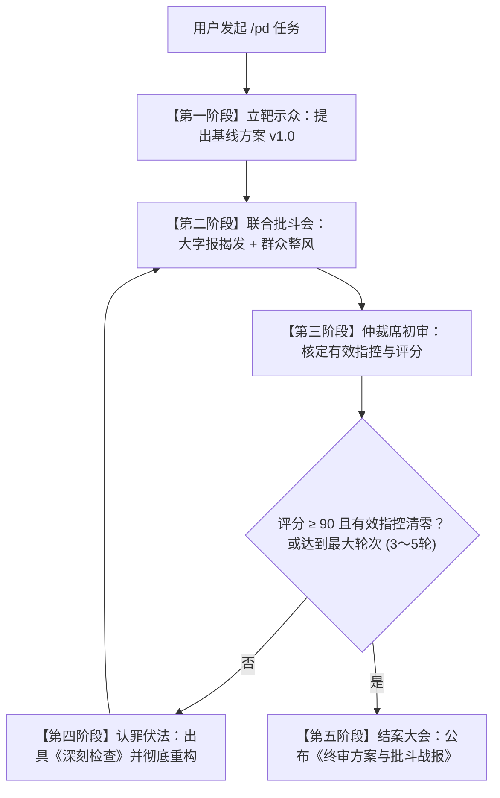

# Antigravity Agent Rules & Discipline Protocols
### 智能体行为基线规则、工程纪律规范与多智能体对抗整风协议 (批斗模式)

[](LICENSE)
[](https://antigravity.google)
[](#二-智能体工程纪律守则-disciplinemd)

面向 **Google Antigravity** 及现代自主 AI 智能体（Agent）的工业级治理框架与高强度批判对抗协议。

---

## 💡 为什么需要这套规范？

在日常使用 AI 编程智能体时，开发者经常面临三大顽疾：
1. **“盲目死循环硬试”**：遇到报错时，智能体在同一个错误路线上连续盲试十几次，不仅浪费大量 Token，还污染代码库与 Git 提交历史；
2. **“形式主义过度工程”**：智能体为了展示“专业性”，动辄堆砌抽象工厂、多层接口与冗余设计模式，将原本 10 行能写完的业务写成几百行“花架子”；
3. **“暗度陈仓与掩盖隐患”**：智能体习惯性编写空捕获 `catch(e) {}`、虚假 mock 测试或偷偷绕过断言，营造出“全部通过”的虚假繁荣。

本项目通过**硬性基线约束**、**两击即停纪律**与**多智能体对抗整风（批斗模式）**，为 AI 智能体戴上“紧箍咒”，逼出最干净、最健壮、经得起考验的极致工程代码。

---

## 📂 项目模块结构

```text
antigravity-agent-rules/
├── rules/
│   ├── GEMINI.md                    # 全局硬性基线规则（环境防灾、Git控制、排版与脚本规范）
│   ├── discipline.md                # 智能体纪律守则（两击即停红线、过程透明自然简报）
│   └── github-publishing.md         # GitHub 仓库发布与分类标签（Topics）规范
├── skills/
│   └── pd/
│       ├── SKILL.md                 # 批斗模式（多智能体对抗批判与极端整风）主技能定义
│       └── references/
│           └── prompts.md           # 四大角色（批斗官/整风官/重构员/仲裁官）Prompt 模板
└── scripts/
    ├── install.ps1                  # Windows PowerShell 一键部署脚本
    └── install.sh                   # Linux/macOS Bash 一键部署脚本
```

---

## 🛡️ 核心模块详解

### 一、 全局硬性基线规则 (`rules/GEMINI.md`)
注入为全局核心约束，杜绝智能体乱动系统环境与破坏规范：
- **浏览器调试禁令**：未经用户允许，严禁擅自唤起浏览器进行黑盒调试；
- **Git 强制版本跟踪**：修改代码与文件必须基于 Git 进行版本控制与备份，严禁擅自生成带时间戳的垃圾物理备份文件；
- **语言与排版防坑**：
  - 强制使用简体中文；
  - 表达范围区间或近似值严禁使用未转义的半角波浪号 `~`（防止成对闭合导致误渲染删除线）；必须使用中文“至/到”、全角“～”、转义符 `\~` 或代码块替代；
- **Windows 批处理脚本硬性规约**：`.bat` 脚本换行必须使用 CRLF，命令与路径严禁包含易导致 CMD 乱码崩溃的 UTF-8 多字节中文，末尾强制包含 `pause` 确保控制台常开防闪退。

---

### 二、 智能体工程纪律守则 (`rules/discipline.md`)
针对多步复杂任务与报错排查的最高行动准则：

#### 1. “两击即停”红线（严惩死循环盲试）
* **尝试上限**：针对同一技术卡点、报错或测试失败，最多只允许自主调整并尝试 **2 次**；
* **两击即停**：第 2 次尝试若仍未解决，**严禁自行发起第 3 次盲目重试**，必须立即暂停工具调用，主动向用户说明情况、复盘已尝试方案、指出卡点原因并给出 1 至 3 个应对选项；
* **严禁掩盖问题**：严禁私自注释断言、强行绕过异常或编写假 mock。

#### 2. 过程透明与自然简报
* **复杂任务对齐**：超过 3 步的任务，动手前必须先用简短条目列出大致步骤；
* **拒绝公式化八股**：连续执行任务期间避免长时间无声黑盒操作（不超 4 至 5 次调用），同步进展时严禁套用机械式“当前阶段/已取得成果/下一步计划”等模板，只挑重点自然口语化汇报。

---

### 三、 批斗模式 (`skills/pd/`)
**极具压迫感、零容忍、反虚伪、上纲上线**的多智能体残酷互批工作流。

#### 1. 角色设定与分工矩阵
| 角色代号 | 身份定位 | 核心立场与审查维度 | 语言风格 |
| :--- | :--- | :--- | :--- |
| **`pd_inquisitor`** | **大字报批斗官**（红队刺客） | 假定系统必崩。专查：并发死锁、内存泄漏、安全穿透、未捕获异常、边界越界。 | 辞色俱厉、大字报揭发体。**必须贴出具体致命崩溃反例**。 |
| **`pd_pragmatist`** | **群众整风官**（工农兵代表） | 反对形式主义。专批：层层抽象、无用接口、过度工程、性能拖沓。 | 辛辣尖锐、实事求是。勒令砍掉一切花架子，返璞归真。 |
| **`pd_defendant`** | **认罪重构员**（原案作者） | 接受批斗并改造。剖析偷懒根源、出具《深刻检查书》并彻底重构。 | 低头认错、狠斗私字一闪念。交出脱胎换骨的全新代码。 |
| **`pd_arbiter`** | **革命委员会仲裁官**（收敛席） | 铁面无私、事实裁判。剔除无理抬杠、裁定有效指控、严格评分（0 至 100）。 | 冷峻威严、一锤定音。根据反例解决率决定继续批斗还是批准结案。 |

#### 2. 批斗大会流转流程



---

### 四、 GitHub 仓库发布规约 (`rules/github-publishing.md`)
在 GitHub 上创建、初始化或正式发布项目仓库时的强制约束：
1. **强制配置分类检索标签（Topics）**：必须配置 3 至 6 个精准高相关的标签，严禁空描述发布；
2. **格式规范**：仅支持小写字母、数字和中划线（`-`），单标签长度严格控制在 50 字符以内；
3. **时机要求**：首个 commit 推送后立即补充配置。

---

## 🚀 快速安装与使用

### 1. 克隆并安装到当前设备

#### Windows (PowerShell)
```powershell
git clone https://github.com/cf3901646/antigravity-agent-rules.git
cd antigravity-agent-rules
.\scripts\install.ps1
```

#### Linux / macOS (Bash)
```bash
git clone https://github.com/cf3901646/antigravity-agent-rules.git
cd antigravity-agent-rules
chmod +x ./scripts/install.sh
./scripts/install.sh
```

### 2. 使用示例
安装完成后，在任意 Antigravity / Gemini 智能体会话中：
* **日常交互**：智能体自动继承《全局硬性基线规则》与《智能体纪律守则》（自动执行两击即停，禁止擅自启动浏览器等）；
* **呼唤批斗模式**：在对话中输入 `/pd`、`批斗` 或 `帮我批斗一下这段代码`，即可自动激活多智能体残酷互批工作流！

---

## 🏷️ 推荐 GitHub Topics

发布此项目时，推荐在 GitHub 仓库的「About」设置中配置以下 6 个 Topics：
`antigravity` `ai-agents` `multi-agent` `prompt-engineering` `coding-assistant` `red-teaming`

---

## 📄 License

本项目采用 [MIT License](LICENSE) 开源许可协议。
